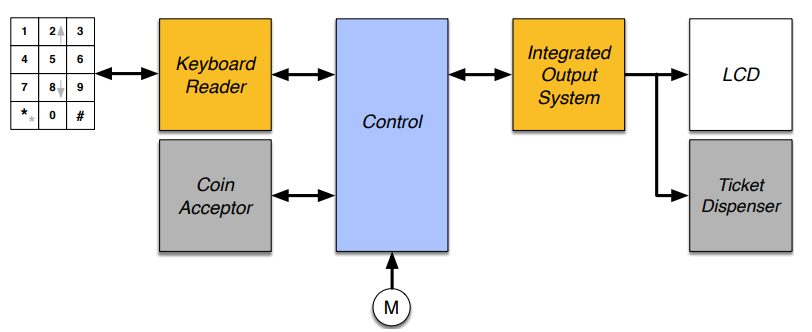
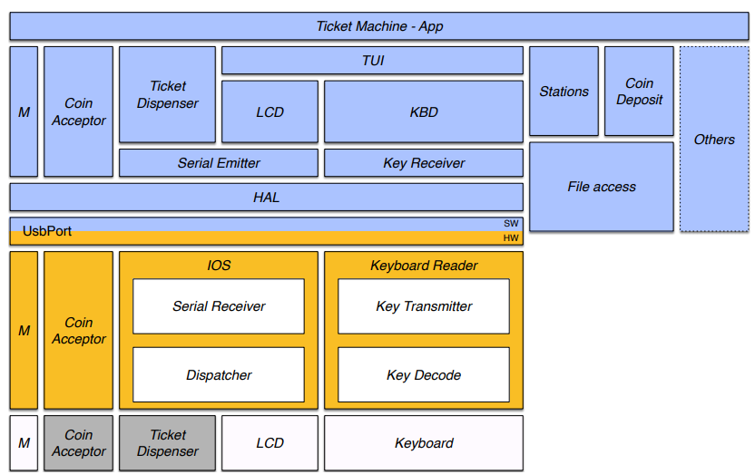
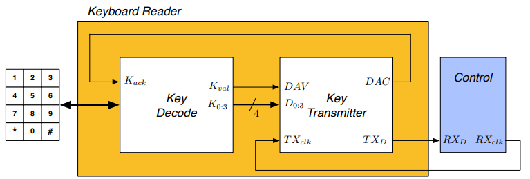
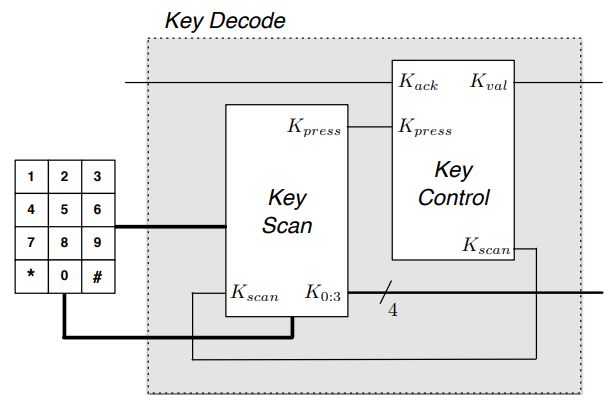
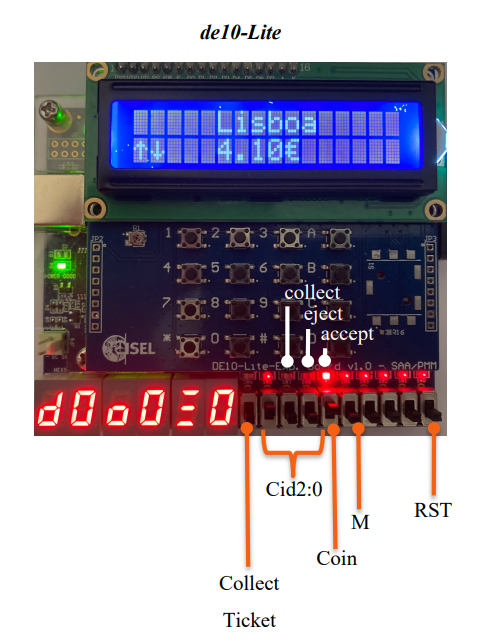

# TickeMachine

    
    
    

## Table of Contents

- [Introduction](#introduction)
- [Application Modules](#application-modules)
- [Software](#software)
- [Hardware](#hardware)
    - [Integrated Output System](#integrated-output-system)
    - [Keyboard Reader](#keyboard-reader)
    - [LCD](#lcd)
    - [Ticket Dispenser](#ticket-dispenser)
- [Fpga Assignments](#fpga-assignments)
- [Simulator](#simulator)
- [Final Report](#final-report)

## Introduction

The goal is to implement a ticket machine that allows you to buy train tickets.
The route is defined by the station of origin, the place where the ticket is purchased and by selecting the destination
by typing in the station identifier or using the ⬆️⬇️ keys, and in addition to the destination station identifier, the
price and type of ticket (one-way ⬆️ or two-way ⬆️⬇️) are displayed on the screen.
The purchase order is given by pressing the confirmation key, and a unit of the
ticket displayed on the screen.
The machine does not make any change and only accepts coins of:
`€0.05`, `€0.10`, `€0.20`, `€0.50`, `€1.00` and `€2.00`.
In addition to the **Sales mode**, the system has another operating mode called **Maintenance**, which is activated by a
**maintenance key**. This mode allows the ticket-vending machine to be tested, and the ticket and coin counters to be
started and checked.
The ticket-vending machine consists of the management system (referred to as Control) and the following peripherals:

- a 12-key keyboard;
- a coin acceptor;
- a two-line, 16-character Liquid Crystal Display (LCD) screen;
- a ticket printing mechanism (Ticket Dispenser);
- a maintenance key (**M**) that switches between

|  |
|:----------------------------------------------------:|
|            *Ticket Machine Architecture*             |

The following actions can be carried out on the system in Sale mode:

- **Consultation and sale** - A ticket can be consulted by typing in the identifier of the destination station or by
  listing it
  using the ⬆️⬇️ keys. The ticket purchase process begins by pressing the `#` key. While entering the coins, the type of
  ticket (one-way or return) can be changed by pressing the `0` key, which will change the price of the journey
  displayed on the LCD, doubling the value in the case of one-way.
  During the purchase, the information relating to the
  desired ticket is displayed on the LCD until the ticket printing mechanism confirms that the printout has been made
  and the ticket has
  been collected by the client.
  The ⬆️ and ⬇️ selection mode alternates with numeric selection by pressing the
  key `*`. The purchase can be canceled by pressing the `#` key, returning the coins entered.

The following actions can be carried out on the system in Maintenance mode:

- **Test** - This menu option allows you to carry out a procedure to consult and sell a ticket, without entering any
  coins and without this operation being counted as a purchase;
- **Query** - To view the coin and ticket counters, select the query operation in the menu and allow the coin and ticket
  counters to be listed using the ⬆️⬇️ keys;
- **Start** - This menu option starts the coin and ticket counters at zero, initiating a new counting cycle;
- **Shutdown** - The system shuts down when this menu option is selected,
  i.e. the management software stops storing the data structures persistently in text files.
  The information on the number of coins and the number of tickets sold is stored in the [CoinDeposit.txt](./CoinDeposit.txt)
  and [Stations.txt](./Stations.txt).
  respectively. These files are read and loaded at the start of the program and rewritten at the end of the program.

> [!IMPORTANT]
> Entering information via the keyboard has the following criteria:
> - if no key is pressed within five seconds, the command in progress is aborted;
> - when the data to be entered is made up of more than one digit, the last digit is taken into account. the command in progress is aborted; insertion takes place from the digit with the greatest weight to the one with the least weight.

> [!NOTE]
> The handout is available [here](./docs/handout.pdf).

## Application Modules

|  |
|:-------------------------------------------------------:|
|                   *Modules Overview*                    |

## Software

Divided into several key modules:

- [App](./src/main/kotlin/ticketmachine/software/App.kt)
- [CoinAcceptor](./src/main/kotlin/ticketmachine/software/CoinAcceptor.kt) | [TestBench](./src/main/kotlin/ticketmachine/software/CoinAcceptor_tb.kt)
- [CoinDeposit](./src/main/kotlin/ticketmachine/software/CoinDeposit.kt)
- [HAL](./src/main/kotlin/ticketmachine/software/HAL.kt) | [TestBench](./src/main/kotlin/ticketmachine/software/HAL_tb.kt)
- [KBD](./src/main/kotlin/ticketmachine/software/KBD.kt) | [TestBench](./src/main/kotlin/ticketmachine/software/KBD_tb.kt)
- [KeyReceiver](./src/main/kotlin/ticketmachine/software/KeyReceiver.kt) | [TestBench](./src/main/kotlin/ticketmachine/software/KeyReceiver_tb.kt)
- [LCD](./src/main/kotlin/ticketmachine/software/LCD.kt) | [TestBench](./src/main/kotlin/ticketmachine/software/LCD_tb.kt)
- [M](./src/main/kotlin/ticketmachine/software/M.kt)
- [SerialEmitter](./src/main/kotlin/ticketmachine/software/SerialEmitter.kt) | [TestBench](./src/main/kotlin/ticketmachine/software/SerialEmitter_tb.kt)
- [TUI](./src/main/kotlin/ticketmachine/software/TUI.kt) | [TestBench](./src/main/kotlin/ticketmachine/software/TUI_tb.kt)
- [TicketDispenser](./src/main/kotlin/ticketmachine/software/TicketDispenser.kt) | [TestBench](./src/main/kotlin/ticketmachine/software/TicketDispenser_tb.kt)

Entry point: [Main](./src/main/kotlin/ticketmachine/software/Main.kt).

## Hardware

To develop the hardware modules, the [VHDL](https://en.wikipedia.org/wiki/VHDL) language was used,
which is a hardware description language
used in electronic design automation
to describe digital and mixed-signal systems such as field-programmable gate arrays and integrated circuits.
Since the IDE chosen was [Quartus Prime](https://www.intel.com/content/www/us/en/software/programmable/quartus-prime/overview.html), several [templates](./src/main/kotlin/ticketmachine/hardware/templates) were used
to better visualize the modules different signals and their interconnections.

### Integrated Output System

[Implementation](./src/main/kotlin/ticketmachine/hardware/ios/IOS.vhd) | [TestBench](./src/main/kotlin/ticketmachine/hardware/ios/IOS_tb.vhd)

This module implements the interface with the [Ticket Dispensing](#ticket-dispenser) and [LCD](#lcd) modules,
serially receiving the information sent by the control module and then delivering it to the recipient, as seen in the
diagram below.

|  |
|:-----------------------------------------------------------------------:|
|                       *Integrated Output System*                        |

Divided into several key modules:

- [Serial Receiver](./src/main/kotlin/ticketmachine/hardware/ios/SERIAL_RECEIVER.vhd) | [TestBench](./src/main/kotlin/ticketmachine/hardware/ios/SERIAL_RECEIVER_tb.vhd)

  |  |
  |:-----------------------------------------------------:|
  |                   *Serial Receiver*                   |

    - [Serial Control](./src/main/kotlin/ticketmachine/hardware/ios/SERIAL_CONTROL.vhd) | [TestBench](./src/main/kotlin/ticketmachine/hardware/ios/SERIAL_CONTROL_tb.vhd)
    - [Counter](./src/main/kotlin/ticketmachine/hardware/ios/COUNTER4BITS.vhd) | [TestBench](./src/main/kotlin/ticketmachine/hardware/ios/COUNTER4BITS_tb.vhd)
    - [Shift Register](./src/main/kotlin/ticketmachine/hardware/ios/SHIFTREGISTER.vhd) | [TestBench](./src/main/kotlin/ticketmachine/hardware/ios/SHIFTREGISTER_tb.vhd)
    - [Parity Check](./src/main/kotlin/ticketmachine/hardware/ios/PARITY_CHECK.vhd) | [TestBench](./src/main/kotlin/ticketmachine/hardware/ios/PARITY_CHECK_tb.vhd)
- [Dispatcher](./src/main/kotlin/ticketmachine/hardware/ios/DISPATCHER.vhd) | [TestBench](./src/main/kotlin/ticketmachine/hardware/ios/DISPATCHER_tb.vhd)
    - [Dispatcher Control](./src/main/kotlin/ticketmachine/hardware/ios/DISPATCHER_CONTROL.vhd) | [TestBench](./src/main/kotlin/ticketmachine/hardware/ios/DISPATCHER_CONTROL_tb.vhd)

> [!NOTE]
> This component report is available [here](./docs/integrated-output-system-report.pdf).

### Keyboard Reader

[Implementation](./src/main/kotlin/ticketmachine/hardware/keyboardReader/KBD.vhd) | [TestBench](./src/main/kotlin/ticketmachine/hardware/keyboardReader/KBD_tb.vhd)

|  |
|:-----------------------------------------------------:|
|                   *Keyboard Reader*                   |

Divided into several key modules:

- [Key Decode](./src/main/kotlin/ticketmachine/hardware/keyboardReader/KEY_DECODE.vhd) | [TestBench](./src/main/kotlin/ticketmachine/hardware/keyboardReader/KEY_DECODE_tb.vhd)

  |  |
  |:-------------------------------------------:|
  |                *Key Decode*                 |

    - [Key Scan](./src/main/kotlin/ticketmachine/hardware/keyboardReader/KEY_SCAN.vhd) | [TestBench](./src/main/kotlin/ticketmachine/hardware/keyboardReader/KEY_SCAN_tb.vhd)
    - [Key Control](./src/main/kotlin/ticketmachine/hardware/keyboardReader/KEY_CONTROL.vhd) | [TestBench](./src/main/kotlin/ticketmachine/hardware/keyboardReader/KEY_CONTROL_tb.vhd)
- [Key Transmitter](./src/main/kotlin/ticketmachine/hardware/keyboardReader/KEY_TRANSMITTER.vhd) | [TestBench](./src/main/kotlin/ticketmachine/hardware/keyboardReader/KEY_TRANSMITTER_tb.vhd)
    - [Key Transmitter Control](./src/main/kotlin/ticketmachine/hardware/keyboardReader/KEY_TRANSMITTER_CONTROL.vhd) | [TestBench](./src/main/kotlin/ticketmachine/hardware/keyboardReader/KEY_TRANSMITTER_CONTROL_tb.vhd)

> [!NOTE]
> This component report is available [here](./docs/keyboard-reader-report.pdf).

### LCD

[Implementation](./src/main/kotlin/ticketmachine/hardware/lcd/LCD.vhd)

|  |
|:-------------------------------------:|
|  *LCD Display mounted on the board*   |

### Ticket Dispenser

[Implementation](./src/main/kotlin/ticketmachine/hardware/ticketDispenser/TICKET_DISPENSER.vhd) | [TestBench](./src/main/kotlin/ticketmachine/hardware/ticketDispenser/TICKET_DISPENSER_tb.vhd)

## Fpga Assignments

The fpga used was the Terasic [De10 Lite](https://www.terasic.com.tw/cgi-bin/page/archive.pl?Language=English&CategoryNo=205&No=1021&PartNo=1),
and the assignment configuration can be found in [this](./docs/fpga/assignments.qsf) file.

|  |
|:------------------------------------------------------------:|
|                  *FPGA Switch Assignments*                   |

## Simulator

The simulator was used to primarily test the software and hardware modules without the need for physical hardware and
to verify the correct operation of software when compared with another hardware implementation or vice versa.

It contains the following files:

- [USB_PORT.properties](./USB_PORT.properties) - UsbPort settings file, allows you to define how it is used;
- [TicketMachine.simul](./TicketMachine.simul) - contains the definition of the modules and interconnections for Kotlin.
  The modules needed to implement the Ticket Machine have been defined,
  with only the UsbPort interface still to be adapted.
  Only the UsbPort interface needs to be adapted to the software already developed,
  defining the `UsbPort.O#` and `UsbPort.I#` connections;
- [Simul.properties](./Simul.properties) - contains the definitions of the Kotlin windows;
- [TicketMachine.jar](./TicketMachine.jar) - jar file with the implementations of the hardware modules for simulation,
  included as a project library.

## Final Report

The final report can be found [here](./docs/final-report.pdf).

---

Instituto Superior de Engenharia de Lisboa 
BSc in Computer Science and Engineering 
Computer and Informatics Laboratory 
Summer Semester of 2021/2022
